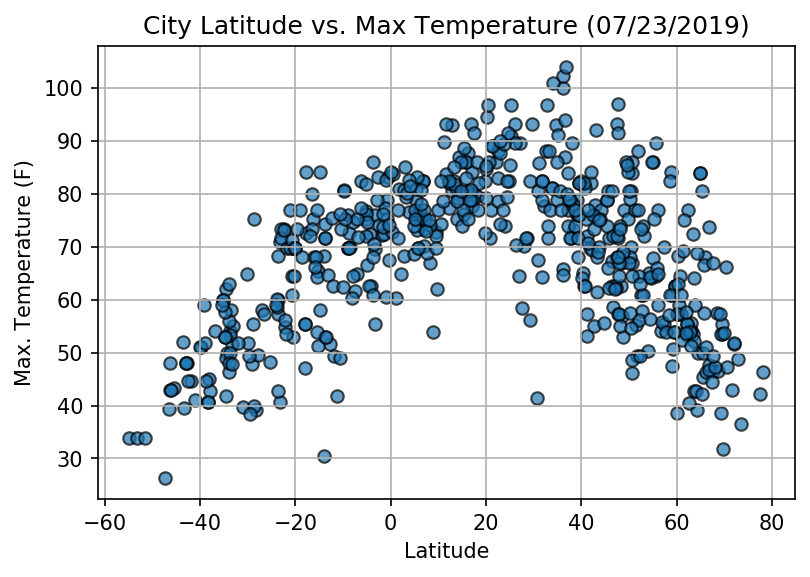
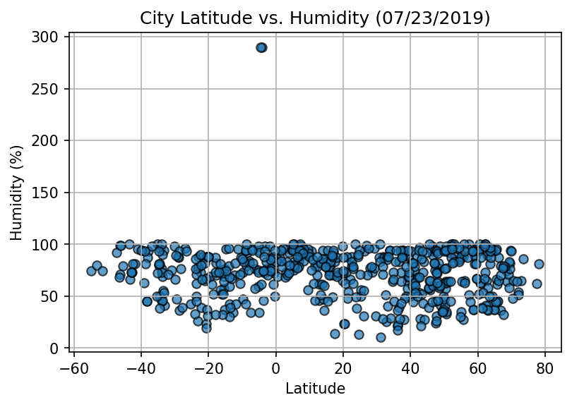
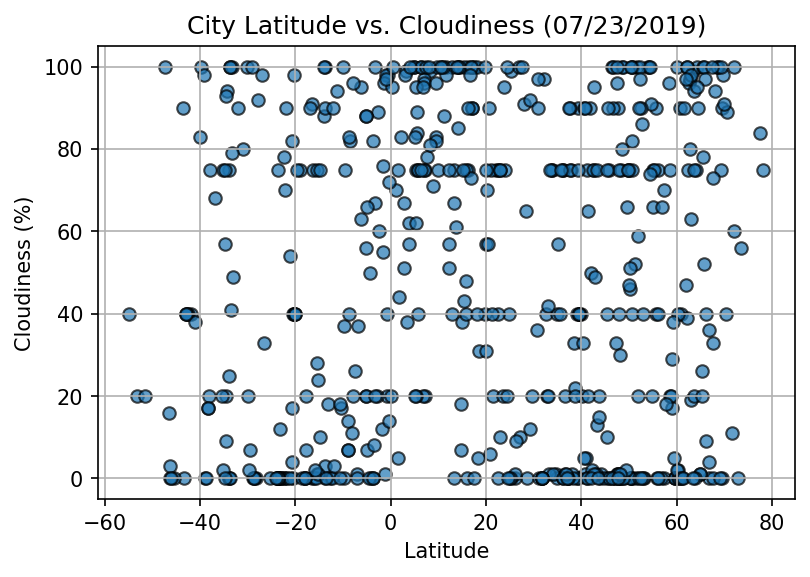
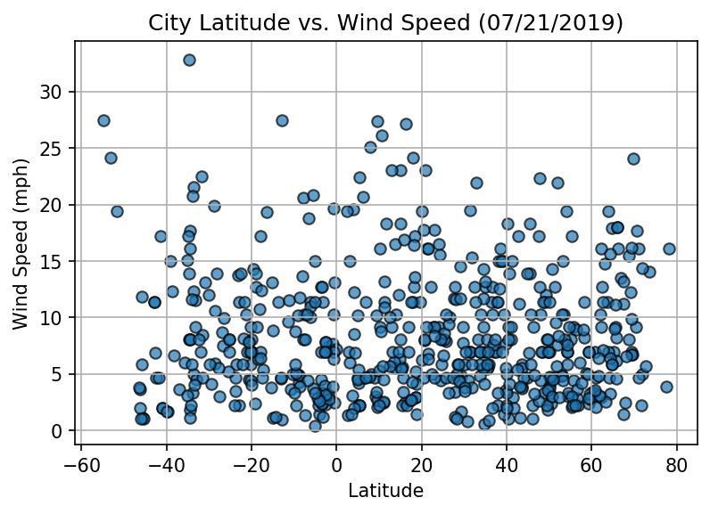

# City-Weather-Analysis

* Files attched 
   * Weather Data for Cities (WeatherPy.ipynb)
   * Plots - 4 plots analysing correlation for each city
   
        * Latitudes - Cloudiness(Plot_CityLatitude_v_Cloudiness.png), 
        * Latitudes - Humidity(Plot_CityLatitude_v_Humidity.png), 
        * Latitudes - Max Temperature(Plot_CityLatitude_v_MaxTemperature.png) and 
        * Latitudes - Wind Speed(Plot_CityLatitude_v_WindSpeed.png) 
        
   * Readme file - Summarizes the project and states 3 trends observed

## About - 
The project aims to visualize the weather of 500+ cities across the world of with various distances from the equator. The list of cities to be analysed were created by two methods, 1) Random numbers were generated for Latitude and Longiture, which were stored as co-ordinates and 2) those co-ordinates were passed to Pyton's library called Citipy which outputs the closest city when passed a co-ordinate. Hence, a list of 500+ cities around the globe was created. This list was then utilized to extract the current weather data for each city using the OpenWeatherMap API. The response was store in a dataframe with each row storing individual city and its weather data. 

## Accuracy of the Dataset - 
Since the dataset is random, we want to get some insight into the clutterness of the data. To do this, we can check the range of latitudes and make sure that the cities in the list are not all coming from the same region of the globe. The folowing was calculated - 

    The range of Latitudes for this analysis is: 133.03
    
    Median value of Latitudes is: 20.96
    
    Mode value of Latitudes is: [-17.73]
    
 
There are 180 possible latitudes and the range of dataset being 133 shows a good estimate of the globe has been covered in respect to varying distance from the globe.

## Statistics to describe the dataset - 

| Measure| Value |
| ------------- | ------------- |
| count  | 571.000000 |
| mean   | 19.480158  |
| std   | 33.181208  |
| min   | -54.810000  |
| 25%    | -7.705000  |
| 50%    | 20.960000  |
| 75%    | 48.135000  |
| max    | 78.220000  |

## City Weather Scatter Plots

  Latitude vs. Temperature Plot
  
  
  Latitude vs. Humidity Plot
  
  
  We can see the outlier in this plot. The outlier is for two cities with humidity = 300%. This is an error from the        OpenWeather API becasue the response for these cities had this vlue for Humidity. This is physically impossible becasue the     cities will have to be under water if this is the case.

  Latitude vs. Cloudiness Plot
  
  
  Latitude vs. Wind Speed Plot
  
  
##Observable Trends

   * There is a lot more demand in Urban areas followed by Suburban and then Rural. This is reflected in each of the charts for  Fares, Drivers and total Rides for which, the data set is dominated by City, then Suburban and then Rural.
   * There is a inverse corelation between Average Fares and total number of rides per city. The average fare is highest for Rural, then Suburban and then Urban Areas while total rides is the lowest for Rural, Suburban and then City. This explains that since there is a lot more demand in cities, and a lot more riders, the price is lower to combat compititions. It would give us more visibility if we know the distance travelled for each ride to observe if the fare is lower in cities due to shorter rides as opposed to Suburban and Rural areas.
   * There are markers for cities which have small size(indicating low number of drivers for the city). But these markers(for example x=35, y=24 approx) indicate that the city has a high demand. Hence, Pyber needs to increase its presence in these cities to meed the expected demand.
